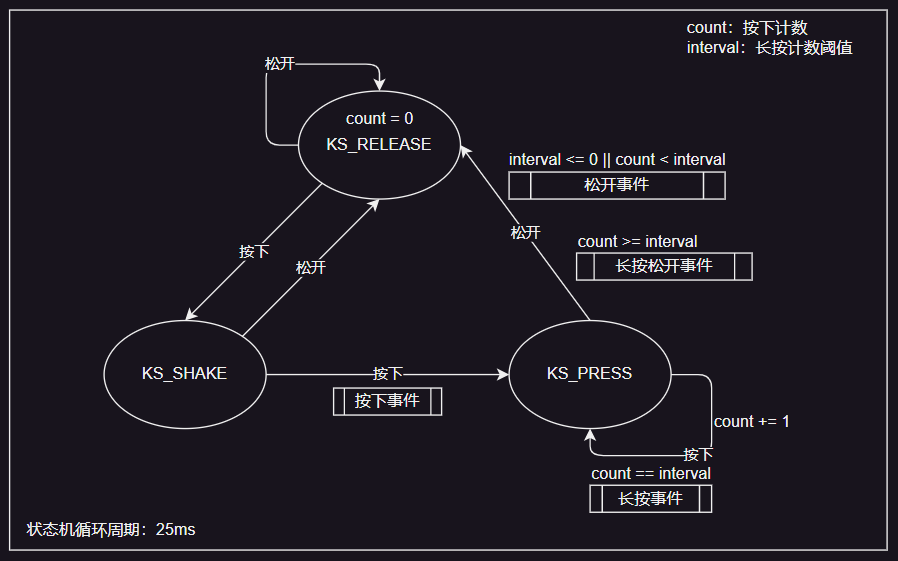
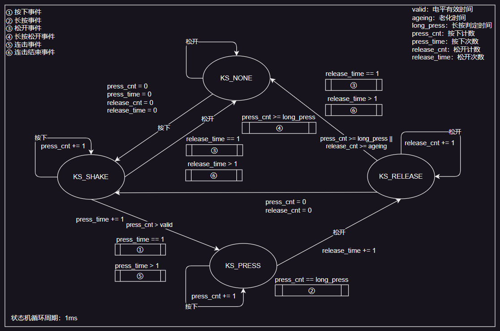

# EVENT BUTTON

通用按键扫描库

## 简易版事件：按下、松开、长按、长按松开

**状态转移图**



**使用方式**

```c
#include "key.h"

static KEY_VALUE get_KEY0() {
  if (LL_GPIO_IsInputPinSet(KEY0_GPIO_Port, KEY0_Pin) == 0) {
    return K_PRESS;
  } else {
    return K_RELEASE;
  }
}

static KEY key = {
    .status = KS_RELEASE,
    .count = 0,
    .get = get_KEY0,
};

/* 25ms 周期执行，长按计数阈值 20 （500ms） */
KEY_EVENT k_ev = key_event_check(&key, 20);
```

当无按键事件时 `k_ev` 的值为 `KE_NONE`，其它值：`KE_PRESS`、`KE_RELEASE`、`KE_LONG_PRESS`、`KE_LONG_RELEASE`

## 连击版事件：按下、松开、长按、长按松开、连击、连击结束

**状态转移图**



**使用方式**

```c
#include "event_button.h"

static KEY_VALUE getKey(void) {
  if (LL_GPIO_IsInputPinSet(B1_GPIO_Port, B1_Pin) == 1) {
    return K_PRESS;
  } else {
    return K_RELEASE;
  }
}

/* 注册按键，25ms 有效电平过滤，500ms 老化时间，1000ms 长按判定时间 */
#define KEY_ID 0
static KEY_LINK keys[] = {
    {
        .key.id = KEY_ID,
        .key.get = getKey,
        .key.custom_data = NULL,
        .key.valid = 25,
        .key.ageing = 500,
        .key.long_press = 1000,
    },
};
key_link_register(keys, sizeof(keys) / sizeof(keys[0]));

/* 注销按键 */
key_link_unregister(KEY_ID);

/* 1ms 周期执行，回调方式 */
void key_event_process(KEY *key) {
    switch (combo_key_event_check(key)) {
        case KE_PRESS: {
            /* 按下 */
        } break;
        case KE_RELEASE: {
            /* 松开 */
        } break;
        case KE_LONG_PRESS: {
            /* 长按 */
        } break;
        case KE_LONG_RELEASE: {
            /* 长按松开 */
        } break;
        case KE_COMBO: {
            /* 连击 */
        } break;
        case KE_COMBO_RELEASE: {
            /* 连击结束 */
        } break;
        default: {
        } break;
    }
}
key_traverse(STRUCT_LINK)(key_event_process);

/* 1ms 周期执行，手动调用 */
KEY *key = key_find_by_id(STRUCT_LINK)(KEY_ID);
key_event_process(key);

/* 获取按键连续按下次数 */
KEY *key = key_find_by_id(STRUCT_LINK)(KEY_ID);
key_combo_press_count(key);

/* 获取按键连续松开次数 */
KEY *key = key_find_by_id(STRUCT_LINK)(KEY_ID);
key_combo_release_count(key);

/* 按键重置 */
KEY *key = key_find_by_id(STRUCT_LINK)(KEY_ID);
key_reset(key);

/* 修改按键，20ms 有效电平过滤，500ms 老化时间，3000ms 长按判定时间 */
KEY *key = key_find_by_id(STRUCT_LINK)(KEY_ID);
key_modify(key, NULL, 20, 500, 3000);
```

当无按键事件时 `k_ev` 的值为 `KE_NONE`，其它值：`KE_PRESS`、`KE_RELEASE`、`KE_LONG_PRESS`、`KE_LONG_RELEASE`、`KE_COMBO_PRESS`、`KE_COMBO_RELEASE`
